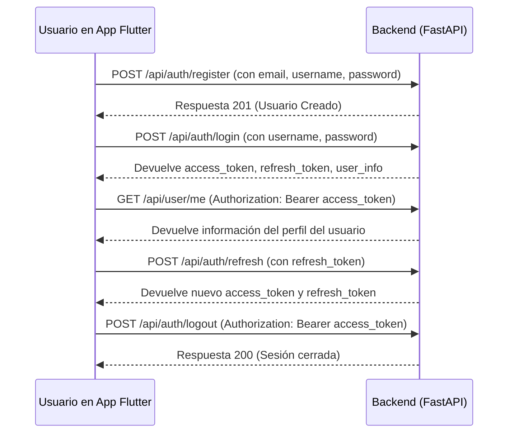

# Documentación de la API: User Control API

### **Resumen Inicial (TL;DR)**

La API, titulada "User control API", está bien estructurada y orientada a servicios para la gestión completa de usuarios. Proporciona todos los endpoints necesarios para un ciclo de vida de autenticación estándar (Registro, Login, Logout, Renovación de Token) y para la administración de perfiles de usuario, con una clara distinción entre las acciones que puede realizar un usuario sobre sí mismo y las que un administrador puede realizar sobre otros.

### **Flujo de Usuario y Arquitectura**

El diseño de la API sugiere un flujo de autenticación y consumo de datos muy claro, ideal para una aplicación cliente como Flutter.

1.  **Registro y Autenticación:** Un usuario nuevo se registra. Al hacer login, la API devuelve un `access_token` y un `refresh_token`, junto con los datos del perfil del usuario.
2.  **Consumo de API:** El `access_token` se debe enviar en la cabecera `Authorization` de cada petición a endpoints protegidos.
3.  **Gestión de Sesión:** Si el `access_token` expira, el `refresh_token` se utiliza para obtener uno nuevo sin que el usuario tenga que volver a iniciar sesión. El logout invalida los tokens en el servidor.

A continuación, un diagrama que ilustra el flujo principal:

### **Análisis de Endpoints por Funcionalidad**

La API se agrupa lógicamente en las siguientes categorías:

#### 1. **Autenticación (`/api/auth`)**
Son los endpoints públicos para gestionar el acceso.
*   `POST /register`: Para crear una nueva cuenta de usuario.
*   `POST /login`: Para iniciar sesión y obtener el par de tokens (`access_token`, `refresh_token`).
*   `POST /token`: Endpoint estándar de OAuth2 para obtener tokens. Funcionalmente similar a `/login`.
*   `POST /validate`: Permite al backend validar un token de acceso, útil para verificar la sesión.
*   `POST /refresh`: Para renovar un `access_token` expirado usando un `refresh_token`.
*   `POST /logout`: Para cerrar la sesión del usuario de forma segura.
*   `GET /public-key`: Expone una clave pública, probablemente para que los clientes puedan verificar la firma de los JWT (JSON Web Tokens) localmente.

#### 2. **Gestión de Usuarios (`/api/user`)**
Endpoints protegidos que requieren un `access_token` válido.
*   `GET /me`: Obtiene la información del perfil del usuario autenticado.
*   `PUT /me`: Permite al usuario autenticado actualizar su propio `email` y `full_name`.
*   `POST /password/change`: Permite al usuario autenticado cambiar su contraseña.
*   `GET /`: **(Admin)** Devuelve una lista paginada de todos los usuarios.
*   `GET /{user_id}`: **(Admin)** Obtiene la información de un usuario específico por su ID.
*   `PUT /{user_id}`: **(Admin)** Permite a un administrador actualizar la información de un usuario específico.

#### 3. **Salud y Raíz (`/status`, `/`)**
*   `GET /status`: Endpoint de "Health Check" para monitoreo.
*   `GET /`: Endpoint raíz que devuelve información básica de la API.

### **Recomendaciones para la Implementación en Flutter**

1.  **Crear un Servicio de API:** Abstraer la lógica de comunicación con estos endpoints en una clase `ApiService` o similar en Flutter. Utiliza un paquete como `http` o `dio`.
2.  **Implementar un Servicio de Autenticación:** Crear una clase `AuthService` que maneje el `login`, `register`, `logout` y el almacenamiento seguro de los tokens. Para esto, el paquete `flutter_secure_storage` es ideal.
3.  **Gestión de Estado:** Utiliza un gestor de estado (como Provider, BLoC, o Riverpod) para manejar el estado de autenticación del usuario (`autenticado`, `no autenticado`, `cargando`) a lo largo de la aplicación.
4.  **Crear Interceptores HTTP (con `dio`):** Configura un interceptor que añada automáticamente el `access_token` a las cabeceras de las peticiones a rutas protegidas. Otro interceptor puede gestionar la lógica de renovación de tokens (si una petición falla con un error 401, intentar usar el `refresh_token` y reintentar la petición original).
5.  **Desarrollar las Vistas:** Construir las pantallas de Login, Registro y Perfil de Usuario que consuman los servicios creados.
